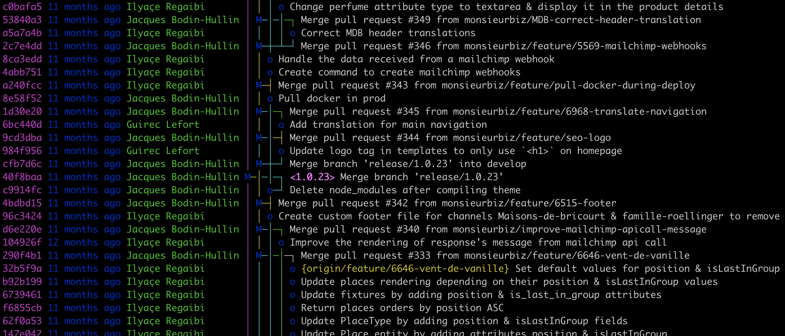

# [fit] How to use ~~GitHub~~ git

### Let's look into it at KIT

----

# What do I use git for?

## To track changes on:

- a source code
- a LaTeX manuscript
- a PDF presentation

----

# What do I use git for?

## To collaborate with others

- work on a presentation with collaborators
- work on a source code with your coworkers
- ask for a review of your article to your co-authors

----

# What do I use git for?

## To share my work

- public sharing on a public GitHub repository (with a license! Mandatory in Germany[^eupl])
- private sharing to some collaborators
- manage your personnal pages? using the GitHub Pages.

[^eupl]: European Union Public License is what you should use if you want to open your code the best way, compatible with the European laws.

----

# Vocabulary[^1]

[^1]: All of it here: <https://git-scm.com/docs/gitglossary>

----

## git

> An open source, distributed version-control system.

## GitHub

> A platform for hosting and collaborating on Git repositories.

Alternatives: GitLab, Bitbucket, SourceForge, Google Cloud Source Repositories…

----

## (git) repository

> Where all your changes are stored.

----

## commit

> A state of changes. Every commit is identified by a reference (the `sha1`).

A commit contains a lot of information such as: author, commiter, message, description, dates…

----

## tree

> The stored representation of your git repository.



----

## merge commit

> When two (or more) branches join and form a commit

😱 An octopus is formed when you merge three branches or more together[^octopus merge are rare]!

[^octopus merge are rare]: I've never done it.

----

## branch

> An active line of development. The most recent commit on a branch is referred to as the tip of that branch.


----

## "master" branch

> Common used name for the default branch.

You could use `main` as well if you don't want to use `master`, or any name you want [^not today].

[^not today]: I'll say `master` here as it's easier for me, because I use `master` for ~12 years now…

----

## local repository

> The repository on your machine.

It's represented by a `.git/` folder.

----

## remote repository

> Identifies your repository on a remote server (like GitHub).

They are _almost always_ a local and a remote repositories. It's rare (and dangerous) to only have a local repository. You use the remote as a backup server! What a nice feature! 💪

All remotes are identified in the `.git/config` file!

----

## "origin"

> The most common used default remote name. 99% of the time the default remote will be named `origin`.

And most of the time you'll have only one remote.

----

## master or origin/master?

> `master` alone is your local branch named `master`.

> `origin/master` is the `master` branch on the `origin` remote.

----

## HEAD or head?

> `HEAD` 


~(tilde) and ^(caret) symbols point to a position relative to the commit

----

## clone

> A copy of your git repository

We "clone" a repository from a remote. Then we have a copy of this repository on our local machine (or wherever we made the clone).

----

## staging area

> Eveything in this area will define your next commit


----

# Visualization

----


----

## On Mistral

```bash
# ~/.bash_profile

# git
module load git/2.27.0-gcc-9.1.0
export PATH=$PATH:/sw/rhel6-x64/vcs/tig-2.2.1/bin

# some git aliases
alias g='git'
alias gs='git status'
```

----

# [fit] Let's start!

----

## Create a **personnal** GitHub account


[.footer: ⚠️ Don't forget to link your professional email to your GitHub account too! (Settings / Emails / Add email address). So GitHub can recognize all your commits.]

----

## Then generate your SSH key, to identify you over SSH

### `$ ssh-keygen -t ecdsa`

```
Generating public/private ecdsa key pair.
Enter file in which to save the key (/Users/jacques/.ssh/id_ecdsa):
Enter passphrase (empty for no passphrase):
Enter same passphrase again:
Your identification has been saved in /Users/jacques/.ssh/id_ecdsa.
Your public key has been saved in /Users/jacques/.ssh/id_ecdsa.pub.
The key fingerprint is:
SHA256:MtED4WQBZ3GlWLeuJz1bqTSo0Mz3Od8U8XvUEmbiklA jacques@JBH.local
The key's randomart image is:
+---[ECDSA 256]---+
|    ..X+o.E      |
|     * * + .     |
|      + = . . =  |
|       . + o + +.|
|      o S + . o +|
|     + o + . . +.|
|    . + = * o ...|
|     . o =.B o  .|
|      .   =o. .  |
+----[SHA256]-----+
```

----

### Two files to backup

Your identification (private key) has been saved in  
`/Users/jacques/.ssh/id_ecdsa`.  

Your **public key**[^to share] has been saved in  
`/Users/jacques/.ssh/id_ecdsa.pub`.


[^to share]: From now on, you'll only share your public key. **NEVER share your private key** (but backup it!!!).

----

#### Tip: generate 2 keys: one on Mistral, one on your machine

----

### Copy your public key's content into your GitHub account

> Top right menu / Settings / SSH and GPG keys / New SSH key


[.footer: If you've generated 1 key on Mistral and 1 key on your local machine: add the two keys on GitHub.]

----

## Configure your machine

Who are you?

```bash
$ git config --global user.name "Your Name, in full, or alias…"
$ git config --global user.email "Your email, personnal or professional"
```

This is stored in your `~/.gitconfig`, so it's a one time operation, even on Mistral:

```
$ cat ~/.gitconfig
[user]
        name = Jacques Bodin-Hullin
        email = j.bodinhullin@monsieurbiz.com
```

----

## Our first repository

> The simple way

Create a new repository on GitHub:  
<https://github.com/new>

Public or Private, it's your choice.  
If you choose Public, don't forget to add a `LICENSE` file.

[.footer: EUPL: https://eupl.eu/1.2/de/ or https://eupl.eu/1.2/en/]

----


----


----

### Then clone it!

```
$ git clone git@github.com:jacquesbh/fortran-model.git
Cloning into 'fortran-model'...
warning: You appear to have cloned an empty repository.

$ cd fortran-model
```

----

### What is my current state?

```
$ git status
On branch master

No commits yet

nothing to commit (create/copy files and use "git add" to track)
```
----

# Protocol

Let's create 2 files: `john.txt` and `doe.txt`

```
$ touch john.txt doe.txt
```

----

```
$ git status
On branch master

No commits yet

Untracked files:
  (use "git add <file>..." to include in what will be committed)
        doe.txt
        john.txt

nothing added to commit but untracked files present (use "git add" to track)
```

----

## Add a file to the staging area

For a specific file: (that's what we do)

```
git add john.txt
```

Or for all the files: (just FYI)

```
git add .
```

----

```
$ git status
On branch master

No commits yet

Changes to be committed:                        <<
  (use "git rm --cached <file>..." to unstage)  << THIS IS THE STAGING AREA 
        new file:   john.txt                    <<

Untracked files:
  (use "git add <file>..." to include in what will be committed)
        doe.txt
```

----

## Commit our stage

```
$ git commit -m"My special message to you, John"
[master (root-commit) 0ff051c] My special message to you, John
 1 file changed, 0 insertions(+), 0 deletions(-)
 create mode 100644 john.txt
```

You can also do a simple `git commit`, then an editor[^editor] will open for you to enter the commit message.

[^editor]: `vi(m)`, `nano`, `emacs`…

----

```
$ git status
On branch master
Your branch is based on 'origin/master', but the upstream is gone.
  (use "git branch --unset-upstream" to fixup)

Untracked files:
  (use "git add <file>..." to include in what will be committed)
        doe.txt

nothing added to commit but untracked files present (use "git add" to track)
```

----
## Push your changes to the origin (to GitHub in our case)

```
$ git push
Enumerating objects: 3, done.
Counting objects: 100% (3/3), done.
Writing objects: 100% (3/3), 627 bytes | 627.00 KiB/s, done.
Total 3 (delta 0), reused 0 (delta 0), pack-reused 0
To github.com:jacquesbh/fortran-model.git
 * [new branch]      master -> master
```

----

## Add a commit on GitHub directly

----

## Fetch the changes

```
$ git fetch
remote: Enumerating objects: 5, done.
remote: Counting objects: 100% (5/5), done.
Unpacking objects: 100% (3/3), 634 bytes | 317.00 KiB/s, done.
remote: Total 3 (delta 0), reused 0 (delta 0), pack-reused 0
From github.com:jacquesbh/fortran-model
   0ff051c..80a3c54  master     -> origin/master
```

----

## Where are we?

```
$ git log
commit 0ff051ca08ad68226928139bd317521303d0ca6c (HEAD -> master)
Author: Jacques Bodin-Hullin <j.bodinhullin@monsieurbiz.com>
Date:   Wed Jul 1 13:41:24 2020 +0200

    My special message to you, John
```

----

## Where is my GitHub commit??

```
$ git log --all
commit 80a3c543ab923922effd1ff292095880ca1f0088 (origin/master)
Author: Jacques Bodin-Hullin <j.bodinhullin@monsieurbiz.com>
Date:   Wed Jul 1 13:44:34 2020 +0200

    Be strong John.

commit 0ff051ca08ad68226928139bd317521303d0ca6c (HEAD -> master)
Author: Jacques Bodin-Hullin <j.bodinhullin@monsieurbiz.com>
Date:   Wed Jul 1 13:41:24 2020 +0200

    My special message to you, John
```

----

### git log is powerful.

```
$ git log --all --graph --oneline
* 80a3c54 (origin/master) Be strong John.
* 0ff051c (HEAD -> master) My special message to you, John
```

----

### Let's create an alias quickly

```
$ git config --global alias.tree "log --graph --all --oneline"

$ git tree
* 80a3c54 (origin/master) Be strong John.
* 0ff051c (HEAD -> master) My special message to you, John
```

----

## Update my current state

```
$ git merge origin/master
Updating 0ff051c..80a3c54
Fast-forward
 john.txt | 1 +
 1 file changed, 1 insertion(+)
```

----

### git pull

> It is the combination of `git fetch` and `git merge`

That's cool!

The merge command can perform a _fast-forward_ if there is no risk of conflict. So do the `git pull` command!

----

```
$ git status
On branch master
Your branch is up to date with 'origin/master'.

Untracked files:
  (use "git add <file>..." to include in what will be committed)
        doe.txt

nothing added to commit but untracked files present (use "git add" to track)
```

----

## Ignore some files

```
echo "/doe.txt" >> .gitignore
```

----

```
$ git status
On branch master
Your branch is up to date with 'origin/master'.

Untracked files:
  (use "git add <file>..." to include in what will be committed)
        .gitignore

nothing added to commit but untracked files present (use "git add" to track)
```

`doe.txt` is ignored by all git operations and we have a new file of course…

----

Let's do a simple `git add .`.

```
$ git status
On branch master
Your branch is up to date with 'origin/master'.

Changes to be committed:
  (use "git restore --staged <file>..." to unstage)
        new file:   .gitignore
```

----

## How to remove from the stage?

```
$ git reset .gitignore
```

----

```
$ git status
On branch master
Your branch is up to date with 'origin/master'.

Untracked files:
  (use "git add <file>..." to include in what will be committed)
        .gitignore

nothing added to commit but untracked files present (use "git add" to track)
```

----

Let's commit `.gitignore` and change the content of `john.txt`.

```
$ git add .gitignore

$ git commit -m"Ignore doe.txt"
[master 588fb2b] Ignore doe.txt
 1 file changed, 1 insertion(+)
 create mode 100644 .gitignore

$ echo "I know." > john.txt
```

----

```
$ git status
On branch master
Your branch is ahead of 'origin/master' by 1 commit.
  (use "git push" to publish your local commits)

Changes not staged for commit:
  (use "git add <file>..." to update what will be committed)
  (use "git restore <file>..." to discard changes in working directory)
        modified:   john.txt

no changes added to commit (use "git add" and/or "git commit -a")
```

----

## How do I change `john.txt` back to it's original content?

```
$ cat john.txt
I know.

$ git diff
diff --git a/john.txt b/john.txt
index 4bfe9c8..456de31 100644
--- a/john.txt
+++ b/john.txt
@@ -1 +1 @@
-Be strong.
+I know.

$ git checkout john.txt
Updated 1 path from the index

$ cat john.txt
Be strong.
```

----

```
$ git status
On branch master
Your branch is ahead of 'origin/master' by 1 commit.
  (use "git push" to publish your local commits)

nothing to commit, working tree clean

$ git tree
* 588fb2b (HEAD -> master) Ignore doe.txt
* 80a3c54 (origin/master) Be strong John.
* 0ff051c My special message to you, John
```

----

Let's push our changes.

```
$ git push
Enumerating objects: 4, done.
Counting objects: 100% (4/4), done.
Delta compression using up to 12 threads
Compressing objects: 100% (2/2), done.
Writing objects: 100% (3/3), 691 bytes | 691.00 KiB/s, done.
Total 3 (delta 0), reused 0 (delta 0), pack-reused 0
To github.com:jacquesbh/fortran-model.git
   80a3c54..588fb2b  master -> master
   
$ git tree
* 588fb2b (HEAD -> master, origin/master) Ignore doe.txt
* 80a3c54 Be strong John.
* 0ff051c My special message to you, John
   
$ git status
On branch master
Your branch is up to date with 'origin/master'.

nothing to commit, working tree clean
```

----

## I have a new idea!

```
$ git branch new-idea

$ git checkout new-idea
Switched to branch 'new-idea'

$ git tree
* 588fb2b (HEAD -> new-idea, origin/master, master) Ignore doe.txt
* 80a3c54 Be strong John.
* 0ff051c My special message to you, John
```

----

Let's add a new file, and commit it.

```
$ echo Hallo KIT! > kit.txt

$ git add kit.txt

$ git status
On branch new-idea
Changes to be committed:
  (use "git restore --staged <file>..." to unstage)
        new file:   kit.txt

$ git commit -m"Hello to KIT"
[new-idea 4e4c997] Hello to KIT
 1 file changed, 1 insertion(+)
 create mode 100644 kit.txt
```

----

```
$ git tree
* 4e4c997 (HEAD -> new-idea) Hello to KIT
* 588fb2b (origin/master, master) Ignore doe.txt
* 80a3c54 Be strong John.
* 0ff051c My special message to you, John
```

----

Let's go back to `master`, create a new branch, add a file, commit it.

```
$ git checkout master
Switched to branch 'master'
Your branch is up to date with 'origin/master'.

$ git checkout -b second-idea
Switched to a new branch 'second-idea'

$ echo "Eurêka" > albert.txt

$ git add .

$ git commit -m"Well said Albert"
[second-idea b1adf2d] Well said Albert
 1 file changed, 1 insertion(+)
 create mode 100644 albert.txt
```

----

```
$ git tree
* b1adf2d (HEAD -> second-idea) Well said Albert
| * 4e4c997 (new-idea) Hello to KIT
|/
* 588fb2b (origin/master, master) Ignore doe.txt
* 80a3c54 Be strong John.
* 0ff051c My special message to you, John
```

----

# [fit] Safety rules 💥

----

### Do NOT delete your `.git` directory!

----

# [fit] Have fun!

----

Contact :

Jacques Bodin-Hullin  
<j.bodinhullin@monsieurbiz.com>

But your best friends are `man` and <https://git-scm.com/doc>.
